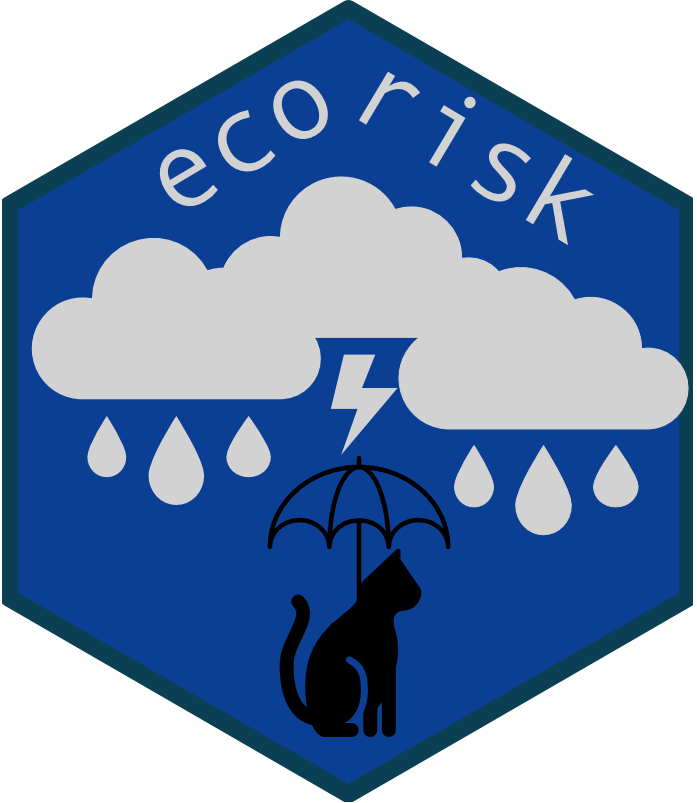

<!-- README.md is generated from README.Rmd. Please edit that file -->

# ecorisk 

<!-- badges: start -->

[](https://github.com/HeleneGutte/ecorisk/actions/workflows/R-CMD-check.yaml)
[](https://CRAN.R-project.org/package=ecorisk)
<!-- badges: end -->

## Overview

ecorisk is an R package operationalizing a modular risk assessment
framework for ecosystem-based management based on semiquantitative
expert scorings or quantitative time-series analysis.

## Installation

Install the latest version from GitHub using the `remotes` package:

``` r
# install.packages("remotes")
remotes::install_github("HeleneGutte/ecorisk")
```

## Usage

An example analysis using the provided demo datasets, and information on
how to apply the ecorisk framework are available in the vignette.

## News
