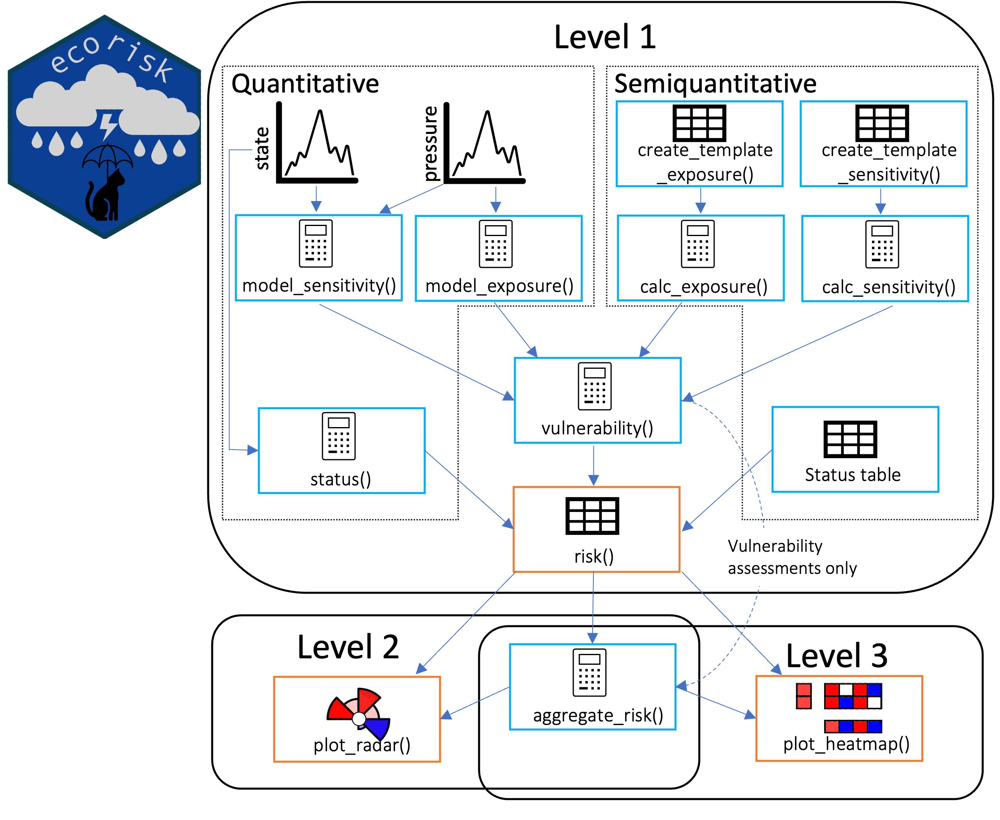

```{r, include = FALSE, echo = FALSE}
knitr::opts_chunk$set(
  collapse = TRUE,
  comment = "#>"
)
```

```{r setup, echo = FALSE, include = FALSE}
library(ecorisk)

```

```{css, echo=FALSE}
pre {
  max-height: 300px;
  overflow-y: auto;
}


.scroll-100 {
  max-height: 100px;
  overflow-y: auto;
  background-color: inherit;
}
```

{width="300"}

## Outline

- [Introduction {#intro}](#introduction-intro)
  - [Overview risk assessments {#ra\_over}](#overview-risk-assessments-ra_over)
  - [Aim of the package {#aim}](#aim-of-the-package-aim)
  - [Brief summary of package and workflow {#summary}](#brief-summary-of-package-and-workflow-summary)
- [How to do a risk assessment {#risk-intro}](#how-to-do-a-risk-assessment-risk-intro)
  - [Scoping {#scoping}](#scoping-scoping)
  - [Preparation {#prep}](#preparation-prep)
  - [Scoring {#scoring}](#scoring-scoring)
  - [Analysis {#analysis}](#analysis-analysis)
- [The ecorisk package theory {#ecorisk}](#the-ecorisk-package-theory-ecorisk)
  - [Risk assessment analysis {#ra-analyis}](#risk-assessment-analysis-ra-analyis)
    - [Expert based semiquantitative pathway {#analysis\_score}](#expert-based-semiquantitative-pathway-analysis_score)
    - [Modelling quantitative pathway {#analysis\_model}](#modelling-quantitative-pathway-analysis_model)
    - [Vulnerability {#vulnerability}](#vulnerability-vulnerability)
    - [Status assessment {#status}](#status-assessment-status)
    - [Risk {#risk}](#risk-risk)
    - [Aggregation {#aggregation}](#aggregation-aggregation)
  - [What to do now? Plotting! {#aftermath}](#what-to-do-now-plotting-aftermath)
- [Ecorisk tutorial](#ecorisk-tutorial)
  - [Background](#background)
  - [Data preparation](#data-preparation)
  - [Analysis](#analysis)
  - [Results](#results)
- [Contact](#contact)
- [References {#references}](#references-references)

# Introduction {#intro}

*ecorisk* is a package for risk assessment analysis in marine sciences,
but can also be applied to terrestrial ecosystems. Risk assessments are
an integral part of integrated ecosystem assessments, which are used
within ecosystem based management [@levin2014]. The implementation of
risk assessments to support ecosystem based management faces a number of
challenges, this includes for example

-   The assessment on an ecosystem level heavily relies on data driven
    modeling approaches e.g.[@Fu2018]. Those data driven quantitative
    approaches are not suitable for information limited systems.
-   To better support ecosystem based management risk assessments should
    be able to assess various indicator types, not only single species,
    but also integrated food web indicators. Other challenges to make
    risk assessments ready for ecosystem based management have been
    identified by [@clark2022].

To better support application of risk assessments in ecosystem based
management this package implements a modular framework, where single
indicator and pressure combinations are semiquantitatively or
quantitatively evaluated and thereafter aggregated to compound risks as
well as an ecosystem risk score. The highlights of this framework
include:

1.  risk assessments from single indicator pressure combination up to an
    ecosystem scale
2.  integration of different knowledge types and thus more flexibility
3.  assessment of integrated management indicators
4.  explicit uncertainty assessment

First this vignette will give you a short introduction of common risk
assessment methods and the terminology used within this package. You
will find this together with a short workflow description in the [first
chapter](#ra_over). The [second chapter](#risk-intro) covers the risk
assessment procedure. The implementation and detailed description of the
usage of the ecorisk functions will be given in [chapter 3](#ecorisk)
and [chapter 4](#functions).

## Overview risk assessments {#ra_over}

Risk assessments are well known in various scientific fields. This
package focuses on marine science (but this does not exclude the
application in another context). Within this field, risk assessment
methods are commonly divided into qualitative, semiquantitative and
quantitative approaches. Additionally risk assessments are classified
according to their level of complexity (based on [@holsman2017]):

Level 1: effects of one pressure on one indicator

Level 2: effects of multiple pressures on one indicator

Level 3: effects of multiple pressures on multiple indicators

Level 3 can be considered as ecosystem level, if the effects of the
pressures on the indicators are aggregated and not considered
individually. Table 1 gives an overview of applied risk assessment
methods assigned to the associated data level and complexity.

*Table 1: Overview of different risk assessment methods with papers
applying those. Some methods have been applied at different data and
complexity levels and are therefore mentioned more often.*

+------------+-----------------+-----------------+-----------------+
| Data       | qualitative     | semiquantitative| quantitative    |
| /          |                 |                 | antitative      |
| Complexity |                 |                 |                 |
| level      |                 |                 |                 |
+============+=================+=================+=================+
| Level 1    | Likelihood-     | Productivity -  | Dose-response   |
|            | Consequence     | Susceptibility  | assessments     |
|            | approach        | approach        | [@Fahd2019;     |
|            | [@fletcher2005] | [@Patrick2010;  |  @Hakanson1980; |
|            |                 |  @stobutzki2001]|  @Kramer2011;   |
|            |                 |                 |  @long1995]     |
|            |                 |                 |                 |
|            |                 |                 |                 |
|            |                 |                 |                 |
|            |                 |                 |                 |
|            |                 |                 |                 |
+------------+-----------------+-----------------+-----------------+
| Level 2    | Qualitative     | Qualitative     | Ecosystem       |
|            | network model   | network model   | modelling \*    |
|            | [@giakoumi2015] | [@altman2011;   | [@Fu2018]       |
|            |                 |  @Cook2014;     |                 |
|            |                 |  @Reum2015]     |                 |
|            |                 | Vulnerability   |                 |
|            |                 | analysis        |                 |
|            |                 | [@allison2009;  |                 |
|            |                 |  @cinner2012;   |                 |
|            |                 |  @Cinner2013;   |                 |
|            |                 |  @gaichas2014;  |                 |
|            |                 |  @Graham2011;   |                 |
|            |                 |  @hare2016]     |                 |
|            |                 | ODEMM framework |                 |
|            |                 | [@knights2015]  |                 |
+------------+-----------------+-----------------+-----------------+
| Level 3    | Qualitative     |                 | Ecosystem       |
|            | network model   |                 | modelling \*    |
|            | [@altman2011;   |                 | [@Fu2018]       |
|            |  @Fletcher2014] |                 |                 |
|            | Vulnerability   |                 |                 |
|            | analysis        |                 |                 |
|            | [@gaichas2014]  |                 |                 |
|            | ODEMM framework |                 |                 |
|            | [@knights2015]  |                 |                 |
+------------+-----------------+-----------------+-----------------+

\* ecosystem approaches are marked with a \*

The central question of each risk assessment is:

**What is the risk that given the effect of the pressure x on the
indicator y, y will reach or remain in an undesirable status?**

To evaluate this question various methods have been developed
[@fernandes2022]. An often used approach is to assess the **exposure**
of the pressure and the **sensitivity** of the indicator, but several
synonyms are used, thus complicating comparability of the methods. In
addition to these two axes some methods assess a third axis: the
**adaptive capacity** or resilience of the indicator. All three
compartments are then combined to the **vulnerability** or in some
methods to the risk. Within this framework exposure, sensitivity and
adaptive capacity form together the vulnerability. Since the central
question includes the **current status of the indicator**, this has to
be included in the risk assessment. (Those methods that do not require
status assessment can still use the output values of the vulnerability
function of this package and treat them as output of the risk assessment
). In the end risk (or vulnerability) scores help to identify,
understand and prioritize the risks resulting from different pressures
[@InternationalOrganizationforStandardization2009].

## Aim of the package {#aim}

With this package we want to facilitate application of risk assessments
in information rich *and* limited situations. We want to encourage users
to incorporate different knowledge types, to widen the evidence base.
For this purpose ecorisk combines semiquantitative scoring approaches
with time series based modelling in one assessment. The framework is
build in a modular and flexible manner, covering all complexity levels
(see [chapter Overview risk assessments](#ra_over)). With ecorisk
individual species can be used as indicators as well as integrated
biodiversity, food web or life-history indices, for example the HELCOM
zooplankton mean size indicator [@helcom] or the OSPAR large fish index
[@lynamc.p.2023]. The framework allows to assess long term pressures as
well as short term extreme events, while explicitly accounting for the
associated uncertainty. The package is generalistic in terms of the
considered spatial and temporal scale and can be applied to a wide range
of ecosystems. To enhance communication to a broader public ecorisk
provides different plotting functions, which can be customized later on.
In the next subchapter you get a brief overview of the ecorisk package
and its workflow. If you directly want to learn how you can perform a
risk assessment go to [chapter 2](#risk-intro) and [chapter
3](#ecorisk). For example application of the ecorisk functions go to
[chapter 4](#functions).

## Brief summary of package and workflow {#summary}

The ecorisk package supports the ecorisk framework (Gutte et al., in
prep) by providing tools for analysis, assessment and communication. The
workflow starts with two pathways, which are later on combined to one.
One pathway provides functions for expert scoring approaches, the other
for risk assessments based on time series data. Both pathways analyse
the two vulnerability components exposure and sensitivity for each
indicator \~ pressure combination. The adaptive capacity can be analysed
within the expert scoring pathway. Both pathways optionally assess the
associated uncertainty of of each component. After assessment of
exposure and sensitivity the package continues within one joint pathway
by combining the vulnerability components, assessing the status of each
indicator, followed by the calculation of the risk from vulnerability
and status. Now the risk scores from each indicator \~ pressure
combination can be aggregated to higher complexity levels up to the
(eco-)system risk score, which can be plotted thereafter. The next
chapters describe in detail how such a risk assessment can be conducted
([chapter 2](#risk-intro)) and the usage of the individual functions
([chapter 3](#ecorisk)).

# How to do a risk assessment {#risk-intro}

To conduct a risk assessment it is useful to split the process into
several parts [@hare2016]:

1.  a scoping phase
2.  preparation phase
3.  scoring phase
4.  analysis phase

In the following the four phases are explained in the ecorisk context.

## Scoping {#scoping}

In the first phase the *risk question(s)* should be clearly defined. The
risk question should also define all relevant spatial and temporal
scales. Based on these definitions representative indicators and
pressures are chosen for the assessment. Once the selection has been
conducted all available data (literature or time series data in the
ecorisk context) will be gathered.

## Preparation {#prep}

The preparation depends on the data level of the assessment. For
semiquantitative expert scoring it is useful to prepare factsheets about
the indicators and the influence of the pressures on them. Scoring
guidelines should clearly define each score the experts can give and a
scoring template supports an easier analysis of the given scores. For
the quantitative time series approach all data must be aggregated to
yearly values, e.g. yearly mean temperature or maximum chlorophyll-a
concentrations in spring.

## Scoring {#scoring}

In the semiquantitative pathway experts will score the risk components
exposure, sensitivity and optionally the adaptive capacity. For a better
compatibility with the quantitative pathway the following scoring scheme
is suggested.

-   Exposure (E) 1 - 5 (low to high impact)

-   Sensitivity (S) -5 - 5 (high negative impact - high positive impact,
    a 0 means no influence)

-   Adaptive capacity (AC) -1 - 1 (no adaptive capacity to good adaptive
    capacity)

-   For all scorings it is recommended to score the associated
    uncertainty on a scale from 1 to 3 (low to high).

The individual expert scorings will be aggregated using the ecorisk
functions for the semiquantitative pathway.

The status can be assessed by the experts too or based on thresholds
from the literature (e.g. HELCOM indicator status reports, IUCN red list
entries).

For the quantitative pathway the prepared time series are analysed with
the ecorisk functions. These will score the exposure, sensitivity and
status of the indicator based on the dynamics of the time series.
Ecorisk automatically evaluates the uncertainty associated with the
exposure and sensitivity scores.

## Analysis {#analysis}

The scores from the previous step will be now combined. First
vulnerability (V) is calculated as follows: $V = (-S + AC) - E$

or if sensitivity was scored to be positive:

$V = (S + AC) + E$

The vulnerability scores are afterwards combined with the status to
derive the final risk scores. The risk scores can the be combined to
higher complexity level, i.e. cumulative effects of the pressures,
cumulative impacts on the indicators and ecosystem risk scores.

# The ecorisk package theory {#ecorisk}

The ecorisk package supports the ecorisk framework (Gutte et al., in
prep.). It provides functions for the semiquantitative expert scoring
and a time series based quantitative approach. Ecorisk supports the
integration of different knowledge types, iterative risk assessment
processes and the analysis of integrated indicators. The ecorisk
workflow is split at the beginning into two pathways (Figure 1),
depending on the data input. In each pathway individual indicator
pressure combinations are analysed for their risk. The pathways are
combined again for the assessment of vulnerability and risk.

{width="600", height = "800"}

## Risk assessment analysis {#ra-analyis}

For the risk assessment with the ecorisk package the user should have
conducted an expert scoring exercise or prepared time series to analyse.
Example data sets can be found in the ecorisk package. Templates for
exposure and a sensitivity and adaptive capacity scoring can be created
using the functions `create_template_exposure()` and `crt_sensitivity()`. The output
can be saved as csv or excel file. After they have been filled out by
the experts, they can directly be anayzed further with the ecorisk
workflow. 

### Expert based semiquantitative pathway {#analysis_score}

The expert scorings are analysed with the functions `calc_exposure()`
and `calc_sensitivity()`. Both aggregate the scores given by the
individual expert. In case several traits have been assessed for the
indicators sensitivity, the function will calculate an aggregated
sensitivity score, but will keep the trait-based scores, thus the
vulnerability can be calculated first per trait and only afterwards be
aggregated.

### Modelling quantitative pathway {#analysis_model}

To calculate an exposure score the function `model_exposure()` analyses
the time series of the pressure. The user has to provide a base line to
which the assessment time frame should be compared. The function
evaluates

1.  how much the conditions of the pressure in the assessment time frame
    differ compared to the baseline measured in standard deviations,

2.  how often a significant deviation (\> 1 standard deviation) from the
    baseline can be observed in the assessment time frame and

3.  how the future trend of the pressure will likely be based on a
    linear model.

The function gives for each compartment a score from 1 - 5 (low to
high) and the future direction of the pressure (increase or decrease). 
A spatial scale can not be evaluated by this function, but the
user can provide a score.\
The function `model_sensitivity()` evaluates the indicators sensitivity
towards the pressure based on the relationship of the indicator and
pressure time series. The relationship will be analysed using a
generalized additive model. It is tested whether the relationship is
significant, if so the strength of the relationship ($R^2$) is used to
set a score from 1 - 5 (low to high). In case the relationship is
non-linear (edf \> 1), the sensitivity score will be increased by 1.
Whether the relationship between indicator and pressure in the
assessment time frame is positive or negative is evaluated using the
slope of a linear model. The uncertainty is scored from 1 - 3 (low to
high) based on the relation of the confidence intervals of the GAM to
the overall range of the input data.

### Vulnerability {#vulnerability}

The `vulnerability()` function uses the scores from the semiquantitative
and the quantitative pathway and combines for each indicator \~ pressure
combination the exposure and sensitivity scores.
For the semiquantitative pathway the following equations are applied (assuming 
that the experts assessed the ongoing dynamics of pressure and indicator, meaning
a negative expert sensitivity score is negative due to the pressure dynamics, e.g.
the temperature increases which is bad for the indicator and thus the indicator
gets a negative sensitivity score):

$V = (-S + AC) - E$
$V = (S + AC) + E$

In the modelling pathway the direction of the vulnerability depends on the
directions supplied by the model_exposure and model_sensitivity functions. 
If both have the same direction a positive effect is assumed, if they have different
direction the vulnerability score will be negative, sensitivity and exposure 
are again summed up to derive the vulnerability score.

### Status assessment {#status}

The function `status()` compares the conditions of the indicator in the
assessment time frame to the baseline conditions. The status can be
either good or undesired, depending on whether the indicator stays
within the predefined thresholds or not. The user can parameterize
whether the indicator should be in similar conditions as during the
baseline or outside of these conditions. The user can also use
semiquantitative data to assess the status by themselves.

### Risk {#risk}

The final risk score will be calculated by the function `risk()`. It
combines the vulnerability and the status scores to a risk score per
indicator \~ pressure combination.

### Aggregation {#aggregation}

The risk scores from all indicator pressure combinations are aggregated
to

1.  multi pressure risk scores (all pressures affecting one indicator)

2.  multi indicator risk scores (all indicators affected by one
    pressure) and

3.  a system risk based on all multi pressure risk scores

using the function `aggregate_risk()`. If the user has the scores from
several experts it is recommended to run the analysis for the scores of
each expert individually and aggregate the risk scores and aggregated
risk scores from all experts afterwards. This also allows to assess
variance between experts.

## What to do now? Plotting! {#aftermath}

The results of the risk assessment can be analysed using the two ecorisk
plotting functions `plot_radar()` and `plot_heatmap()`. The first one
shows per indicator the multi pressure risk and the individual risk
scores, deriving the multi pressure risk score. The heatmap plot gives
an overview over all assessment results. In the bottom right corner it
provides the system risk, the map shows the risks for each indicator
pressure combination and to the left and at the bottom the multi
pressure / multi indicator risks are displayed. Both plotting functions
can show the associated uncertainty.

# Ecorisk tutorial

## Background

Let's suppose we want to conduct a risk assessment for a fictional
marine ecosystem. We want to investigate whether the system is at risk
of being in an undesired state due to 5 ongoing pressures:

-   Temperature increase due to climate change
-   Salinity decrease due to climate change
-   a decreasing nutrient input after a phase of eutrophication
-   oxygen depletion
-   fishing pressure

To best represent our ecosystem we choose state indicators from
different trophic levels: phytoplankton, zooplankton, two fish species
(herring and cod), and seabirds. For some of these we have more or less
detailed expert knowledge and for some of them we have time series
representing this state indicator. Thus we decide on the following
assessment scheme using both the expert scoring and the modelling
pathway of ecorisk:

```{r indicator overview, echo = FALSE}
ind_data <- data.frame(
  Trait = c("Cod", " Herring"), 
  General = c("Phytoplankton", "Seabirds"),
  Model = c("Cod spawning stock biomass", "Zooplankton mean size")
)

knitr::kable(ind_data, booktabs = TRUE) |>
  kableExtra::add_header_above(c("Expert scoring pathway" = 2, 
    "Modelling pathway" = 1)) 
```

For the two fish species enough knowledge is available for a detail
expert scoring using species traits. Phytoplankton and seabirds are
larger species groups, a scoring on a trait basis would be very
difficult, therefore the experts will give here only one general score
for sensitivity and adaptive capacity of these two groups. The time
series we want to use for the modeling approach are i) spawning stock
biomass of the cod stock as indicator for the health of the species and
ii) zooplankton mean size which represents the status of the zooplankton
group and gives an indication about the status of the food web. The
pressures will be assessed using both pathways.

## Data preparation

First step is to create the scoring tables, which will be filled out by
our experts. With the functions `create_template_exposure()` and
`crt_sensitivity()`, we can automatically create tables for further
usage in the ecorisk workflow. The functions need the names of the
pressures and for sensitivity also the names of the indicators. For
exposure we want to investigate 4 components:

-   the magnitude of change,

-   the future trend,

-   the frequency of the change and

-   the spatial coverage of the change in the ecosystem.

To define vulnerability the experts should score the sensitivity and the
adaptive capacity. They should differentiate between two types of
effect: direct effects only and the combination of direct and indirect
effects. Indirect effects occur for example due to food web
interactions. If possible the experts will score four individual species
traits:

-   Feeding

-   Behaviour

-   Reproduction

-   Habitat

otherwise they will give general sensitivity and adaptive capacity
scores. Both the exposure and the sensitivity scoring include an
uncertainty assessment. As a second step we rename the variables in our
scoring templates.

```{r create tables, class.output="scroll-100"}
exposure_scoring <- create_template_exposure(
  pressures = c("temperature", "salinity", "oxygen", "nutrient", "fishing"),
  n_components = 4, 
  mode_uncertainty = "component"
)
names(exposure_scoring)
# Rename exposure components
names(exposure_scoring)[2:9] <- c("magnitude", "frequency", "trend", "spatial",
                                  "uncertainty_magnitude", "uncertainty_frequency",
                                  "uncertainty_trend", "uncertainty_spatial")

sensitivity_scoring <- create_template_sensitivity(
  indicators = c("phytoplankton", "herring", "cod", "seabirds"),
  pressures = c("temperature", "salinity", "oxygen", "nutrient", "fishing"),
  type = c("direct", "direct_indirect"),
  n_sensitivity_traits = 5,
  mode_adaptive_capacity = "trait",
  mode_uncertainty = "trait"
)
names(sensitivity_scoring)

# Replaice the generic traits names ('...trait_1', '...trait_2') with
# the actual trait names
names(sensitivity_scoring) <- names(sensitivity_scoring) |> 
  stringr::str_replace("trait_1$", "feeding") |> 
  stringr::str_replace("trait_2$", "behaviour") |> 
  stringr::str_replace("trait_3$", "reproduction") |> 
  stringr::str_replace("trait_4$", "habitat") |> 
  stringr::str_replace("trait_5$", "general") 
```

The experts have filled out the scoring tables in a joint exercise, thus
we do not have to aggregate the individual expert scores. If individual
expert scores are given, it is recommended to follow the work flow until
the risk calculation and aggregation of risk scores is completed and
then aggregate these scores across all experts. This allows for more
precise and detailed results, as differences in the results between
experts can be evaluated.

```{r read expert scores}
exposure_scoring <- ex_expert_exposure
head(exposure_scoring)
sensitivity_scoring <- ex_expert_sensitivity
head(sensitivity_scoring)
```

The experts followed this scoring scheme:

-   Exposure 1- 5 (low to high)

-   Sensitivity -5 - 5 (high negative to high positive influence)

-   Adaptive capacity -1 - 1 (low to high)

-   Uncertainty 1 - 3 (low to high)

For more information about this scheme see also section [2.3. Scoring](#scoring). 
This scoring scheme aligns with the results of the modelling pathway.

To prepare the modelling pathway we load our time series data. The data
includes indicator variables for our five pressures and two state
indicators (cod and zooplankton). The data covers a time frame from 1984
to 2016. The data was created based on trends of similar indicators from the Baltic Sea.
There is another example data set with data from the North Sea. 

```{r read time series data}
ts_pressures <- pressure_ts_baltic
head(ts_pressures)
ts_indicators <- indicator_ts_baltic
head(ts_indicators)
```

## Analysis

Now we will calculate exposure and sensitivity scores in both pathways.
We start with the expert scoring pathway using the functions
`calc_exposure()` and `calc_sensitivity()`. They calculate from the
exposure components and sensitivity trait scores general scores using an
aggregation method selected by the user. We will use the arithmetic mean
to aggregate component and trait scores. Other options are median,
minimum or maximum.

```{r exposure and sensitivity expert pathway, echo = TRUE}
exp_expert <- calc_exposure(
  pressures = exposure_scoring$pressure, 
  components = exposure_scoring[ ,2:5],
  uncertainty = exposure_scoring[ ,6:9],
  method = "mean"
)
head(exp_expert)

sens_ac_expert <- calc_sensitivity(
  indicators = sensitivity_scoring$indicator, 
  pressures = sensitivity_scoring$pressure,
  type = sensitivity_scoring$type,
  sensitivity_traits = sensitivity_scoring[ ,4:8],
  adaptive_capacities = sensitivity_scoring[ ,9:13],
  uncertainty_sens = sensitivity_scoring[ ,14:18],
  uncertainty_ac = sensitivity_scoring[ ,19:23], 
  method = "mean"
)
head(sens_ac_expert)
```

Both data sets now contain the aggregated expert scores. The sensitivity
dataset also contains the initial expert scores, thus we can still
calculate vulnerability for each trait individually, which will lead to
more precise results. Additionally the last column gives information
about the pathway of the scores to compare later on the results from
both pathways.

In the modelling pathway we use the functions `model_exposure()` and
`model_sensitivity()`. To assess exposure based on a time series we have
to define a period where baseline conditions are assumed, the baseline
conditions are then compared to the conditions in the assessment time
period. In this tutorial the baseline is set to the first 10 years of
the time series and the assessment time period are the last 5 years of
the time series. Since baseline conditions are considered as "good" for
our ecosystem all pressures should return to baseline conditions, we
specify this with the argument trend. The spatial scale cannot be
assessed with temporal data only, thus we have to specify the scores. We
use here the same value for the spatial component that the experts gave
for the pressures in the expert scoring.

```{r model exposure}
exposure_model <- model_exposure(
  pressure_time_series = ts_pressures,
  base_years = c(start = 1984, end = 1993),
  current_years = c(start = 2007, end = 2016),
  trend = "return", 
  spatial = c(2, 2, 5, 5, 3, 3, 2, 2)
)
exposure_model
```

The output gives us the aggregated exposure score, which is the
arithmetic mean of all exposure components. These are the same
components that have been evaluated by our experts. The
`model_exposure()` function does not evaluate the associated
uncertainty.

We should check for all pressures if the direction is capturing the correct 
dynamics and not only a short term fluctuation.

To assess sensitivity with time series data we also have to specify the
assessment time period to determine if the pressure has in the
assessment time period a negative or positive influence on the state
indicator. The influence is determined using a simple linear model, so
we can simply check if the direction was correctly determined using a
simple plot. First we set up a data frame specifying for each indicator
pressure combination the assessment time period.

```{r model sensitivity}
sens_ac_model <- model_sensitivity(
  indicator_time_series = ts_indicators, 
  pressure_time_series = pressure_ts_baltic,
  current_years = c(start = 2010, end = 2016)
)
sens_ac_model
```

The output of the function contains for each indicator and pressure
combination the type of effect, the sensitivity score, the uncertainty
associated with the uncertainty scoring and the model parameters that
are used for the sensitivity scoring. The function evaluates sensitivity
using a generalized additive model, if it is significant the $R^2$ value
is used to set a score between 1 and 5. For non-significant models the
score is set to 0. The edf score evaluates non-linearity of the
relationships, as these are more risky, the sensitivity will be
increased for edf scores \>1, but maximum to 5. 

Lets continue by calculating the vulnerability for both pathways with
the function `vulnerability()`. The vulnerability function combines
exposure, sensitivity and adaptive capacity into the vulnerability
score. For negative sensitivity score the following function applies:

$V = (S + AC) - E$ and for positive scores:

$V = (S + AC) + E$,

where V = vulnerability, S = sensitivity, AC = adaptive capacity and E =
exposure. For trait based scoring this will be done for each trait
individually. The vulnerabilities of each trait will then be aggregated,
we can decide with the parameter method_v if we want to use an
arithmetic mean, median, minimum or maximum for the aggregation, same
applies for aggregation of trait based uncertainty scores.

```{r vulnerability}
vuln_experts <- vulnerability(
  exposure_results = exp_expert, 
  sensitivity_results = sens_ac_expert,
  method_vulnerability = "mean",
  method_uncertainty = "mean"
)

vuln_model <- vulnerability(
  exposure_results = exposure_model, 
  sensitivity_results = sens_ac_model,
  method_vulnerability = "mean",
  method_uncertainty = "mean"
)

head(vuln_experts)
head(vuln_model)
```

The output of the vulnerability gives us for each indicator pressure
type combination the vulnerability score with its associated uncertainty
and the pathway with which the vulnerability has been determined.

To calculate the risk we need to know whether the indicator is currently
in a good or undesired state, since the risk to be in an undesired state
is higher if the indicator is already in it. Status can be determined by
the experts or using the time series of the indicator. Our experts have
assessed that phytoplankton and seabirds are currently in a good state,
but herring and cod unfortunately not. An undesired state gets a score
of -1 and a good state of +1.

```{r status experts}
status_experts <- data.frame(
  indicator = c("phytoplankton", "herring", "cod", "seabirds"), 
  status = c("good", "undesired", "undesired", "good"),
  score = c(1, -1, -1, 1)
)
status_experts
```

In the modelling pathway the function `status()` evaluates indicator
status based on time series. To assess the status we have to set
baseline conditions where the indicator is assumed to be in a good
status and our assessment time frame for which the status shall be
evaluated (similar to the `model_exposure()`) function. Additionally we
can set a range around the baseline mean which is considered as good
status. We can specify whether it is undesired if the indicator is in
the assessment time period below or above this range using the arguments
`sign` and `condition`. For our status assessment we assume good
baseline conditions in the first ten years as the mean ± 1 standard
deviation. Undesired status is defined as being below 1 standard
deviation so we set sign = "-" and condition = "\<".

```{r status model}
status_model <- status(
  indicator_time_series = ts_indicators,
  base_years = c(start = 1984, end = 1993),
  current_years = c(start = 2012, end = 2016),
  sign = "-", 
  condition = "<"
)
status_model
```

Both of our indicators are in the assessment time period in an undesired
status.

Now we combine vulnerability and status to the final risk scores. Both
pathways use the function `risk()`.

```{r risk}
risk_expert <- risk(
  vulnerability = vuln_experts, 
  status = status_experts
)
risk_model <- risk(
  vulnerability = vuln_model, 
  status = status_model
)

head(risk_expert)
head(risk_model)
```

The output of the risk function gives us per indicator - pressure - type
combination the risk, calculated from vulnerability and status, as well
as the uncertainty associated with the risk evaluation. Before we
combine both data frames we will rename the pressure variables of the
model based risk assessment to align with the names of the expert based
assessment. This is necessary to correctly aggregate the risk values per
pressure to multi pressure risk scores. Furthermore we will select for
each pressure, which has more than one variable one of them. We follow
here a precautionary approach thus we will select the one posing the
highest risk.

```{r rename and select pressure variables model pathway}
risk_model <- risk_model[c(1, 3, 5, 7, 8, 9, 12, 14:16), ]
risk_model$pressure <- c(
  "nutrient", "temperature", "salinity", "oxygen", "fishing",   # for zooplankton
  "nutrient", "temperature", "salinity", "oxygen", "fishing")   # for cod
```

Now we combine both risk assessment data sets and aggregate them to get
multi pressure, multi indicator and ecosystem risk scores. The
aggregated score will automatically be calculated per pathway, type,
pathway and type, and without accounting for type or pathway.

```{r aggregate pathways and risks}
risks <- rbind(risk_expert, risk_model)

aggregated_risk <- aggregate_risk(
  risk_results = risks, 
  method = "mean"
)

aggregated_risk$multi_indicator_risk
aggregated_risk$multi_pressure_risk
```

The aggregated risk scores are in three lists:

-   One with all risks aggregated per pressure,

-   one aggregated per indicator and

-   one with the ecosystem risk, which is an aggregation of all multi
    pressure risk scores.

In all lists the scores are first aggregated per type and pathway, then
per type regardless of the pathway, then per pathway regardless of the
type and as last regardless of the type and pathway.

## Results

To get an easier overview of the results and help with the
interpretation ecorisk provides two plotting functions `plot_radar()`
and `plot_heatmap()`.

The first one creates for each indicator a radar plot with the risk
scores per pressure and type. In the centre it shows the aggregated
multi-pressure risk, we have to select which we want to use. This plot
helps to identify per indicator the most influencing pressures and
compare results from different types. If uncertainty has been assessed
this will be displayed as a ring around the radar plot. In this example
we will the use the aggregated score of direct and indirect effects,
regardless of the pathway. Theses are assumed to better reflect reality
compared to direct effects only.

```{r plot radar, fig.width=6, fig.height=6}
p_radar <- plot_radar(
  risk_scores = risks,
  aggregated_scores = aggregated_risk,
  type = "direct_indirect", 
  pathway = "combined"
)

p_radar[[1]]
p_radar[[2]]
p_radar[[3]]
p_radar[[4]]
p_radar[[5]]
p_radar[[6]]
```

All of the indicators have a negative multi-pressure score. The
indicators assessed with the expert scoring pathway show a higher risk
due to the combined direct and indirect effects compared to direct
effects only. The uncertainty is generally lower in the modelling
pathway. Comparing the modelling and expert pathway for cod it is
noticeable that both have a similar multi-pressure score but the
individual risk scores are quiet different: The experts assessed fishing
as the most influencing pressure, whereas in the modelling pathway
salinity is considered as the pressure with the highest impact. To
directly compare modelling and expert pathway for cod we can correlate
them in a plot:

```{r correlation plot, fig.width=6, fig.height=6}
temp <- risks[c(26:30, 45:49), c(1, 2, 7)]
temp <- temp |>
  tidyr::pivot_wider(names_from = indicator, values_from = risk)

ggplot2::ggplot(dat = temp, 
    ggplot2::aes(x = cod, y = eastern_baltic_cod, colour = pressure)) +
  ggplot2::geom_point() +
  ggplot2::geom_abline(slope = 1, intercept = 0) +
  ggplot2::xlim(-10, 10) + 
  ggplot2::ylim(-10,10) +
  ggplot2::labs(x = "Expert-based pathway", y = "Modelling-based pathway") +
  ggplot2::theme_minimal()
```

We can see that the risk scores for nutrients, oxygen and temperature are quiet
similar for both pathways. But the values for salinity indicate no risk in the modelling pathway. 
This might be due to a salinity time series that does not catch the ongoing dynamics, and thus
resulting in a non significant relationship between pressure and indicator.
The scores for fishing have even opposing directions, this
could be due to a different understanding of fishing and the future developments:
In the modelling pathway it has been shown that fishing is decreasing, which will
be positive for the indicators, thus in the future it will have a positive effect. 
But the expert probably assumed that fishing will always have negative effects, 
without considering the positive development of the decreasing fishing pressure. 
This is a linguistic uncertainty, which should have been discussed in the planning
and scoping phase of the assessment, to ensure that all have a common understanding.
Nevertheless we should reiterate with our experts as well as check if the 
`model_sensitivity()` and `model_exposure()` function have
correctly determined the effect direction.

The function `plot_heatmap()` creates for each assessment type a heatmap
of all pressure indicator combinations, optionally with the associated
uncertainty. The aggregated multi-pressure and indicator scores are
shown at the bottom and to the left of the heatmap as well as the system
risk score at the bottom right. For the aggregated scores we have to
choose which one we want to use as we already did for the `plot_radar()`
function. This function gives an complete overview of the system
dynamics allowing to easily compare ecosystems and determine by which
indicators and pressures ecosystem risk is driven.

```{r plot heatmap, fig.width = 8, fig.height=9, out.height="25%", out.width="%"}
p_heat <- plot_heatmap(
  risk_scores = risks,
  aggregated_scores = aggregated_risk,
  uncertainty = TRUE
)

p_heat[[1]]
p_heat[[2]]
```

The first heatmap includes only direct effects, thus this heatmap is a
bit smaller as we did not assess for all indicators direct effects only.
The multi pressure and indicator scores are the aggregated direct scores
for all assessed pathways. The grey frame around the heatmap tiles show
the uncertainty associated with the score. We can see with this heatmap
that cod is the indicator most at risk, this risk is due to high effects
of fishing and temperature. The least at risk indicators are
phytoplankton and seabirds. Both are not affected by several of the
pressures, but still seabirds are at a medium to high risk due to
fishing. The second heatmap shows the direct and indirect effects
including also the indicator which were assessed with the modelling
pathway. Again the cod indicator is most at risk, followed by the
modelled cod indicator, herring and seabirds. The pressures with the
highest negative impact are temperature and fishing. Zooplankton is an
example for an indicator which will likely thrive under the pressures.
It is still worthwhile to include such indicators in a risk assessment
as these positive changes in one indicator can have negative effects for
the entire system, thus every change can bear a risk for the system.
Overall the system is a bit more at risk considering the combination of
direct and indirect effects compared to direct effects only.

What can we do now with the results of our risk assessment? Here are
some examples:

-   We can inform the management by prioritizing which pressures pose
    the highest risk and which indicators are most at risk.
-   We can use the information to guide research: did any effect come by
    surprise (especially from the modelling pathway)? Which risks are
    associated with high uncertainties?
-   If we are interested in non - linear effects and how indicators and
    pressures interact with each other we could use our results as a
    basis for a network analysis and develop questions based on the risk
    assessment output or select specific indicator and pressure
    combinations that we want to further investigate with a more
    quantitative analysis.

# Contact

If you have issues with the package or questions please send an e-mail
to:
[helene.gutte\@uni-hamburg.de](mailto:helene.gutte@uni-hamburg.de){.email}

# References {#references}
